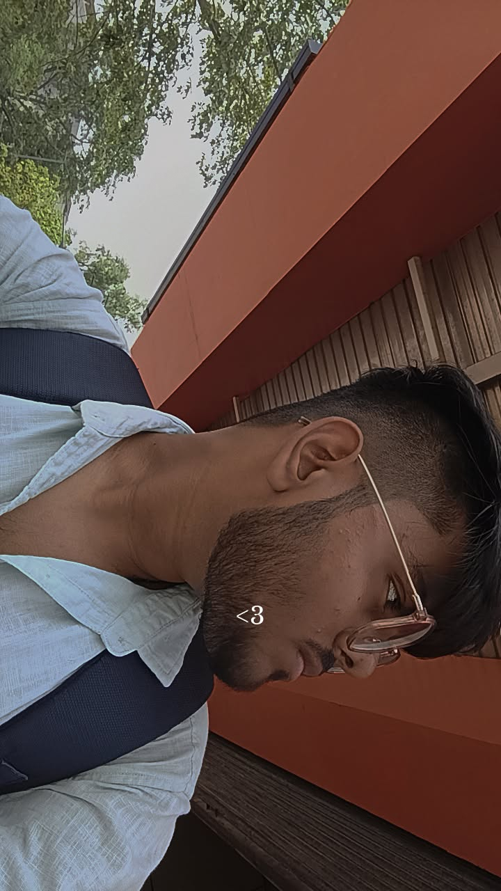

  

 
<h1 data-importer="text" align="left">
 

  

###

<h3 data-importer="text" align="left">This is Rudra Deepak . 🚀 AI/ML Enthusiast |</h3>

###

<h2 data-importer="text" align="left">About me</h2>

###

✨ Creating bugs since 2006 📚 I'm currently learning B.Tech in AIML 🎯 Goals: Nothing Much 🎲 Fun fact:  📍Volunteer at @ AWS Summit Bengaluru 2026

###

<h2 data-importer="text" align="left">I code with</h2>

###

  
  
  
  
  
  
  
  
  
  
  
  
  
  
  

###

###

## 📫 Connect with me

 

  

## 📊 GitHub Stats

  

 

###
